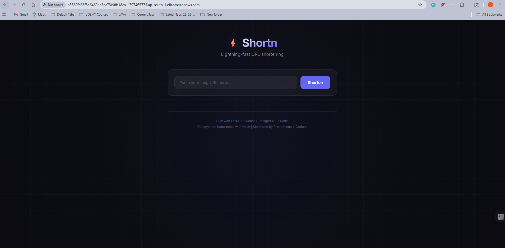
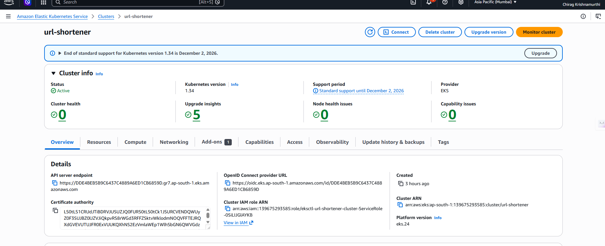
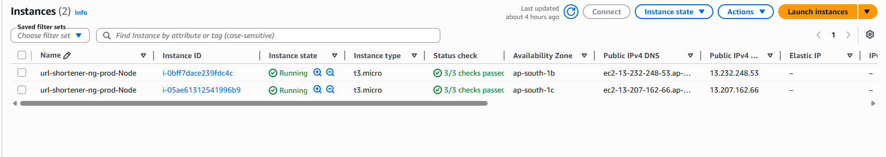
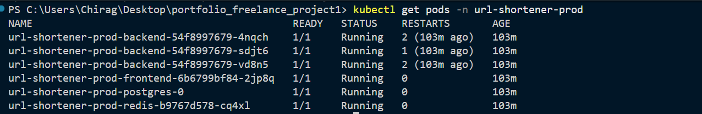
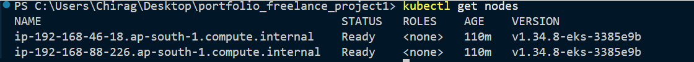
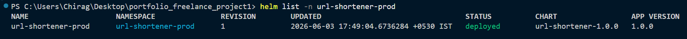
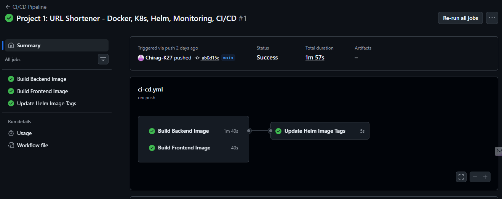
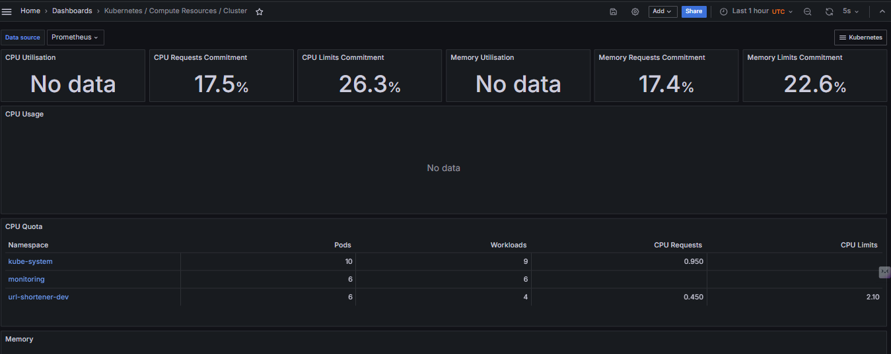
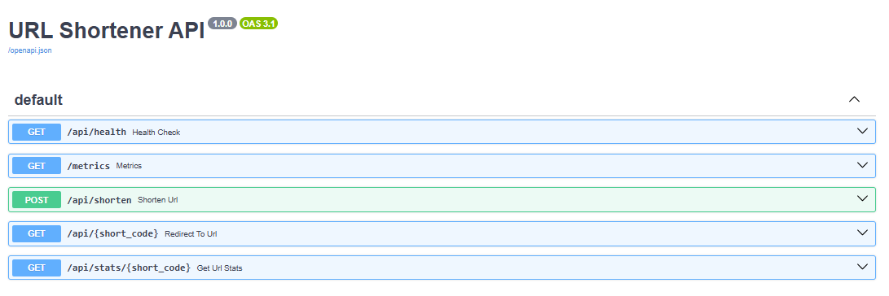
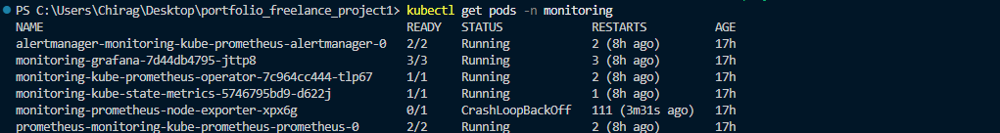

# ⚡ Shortn — Production-Grade URL Shortener

A microservices-based URL shortening platform with full DevOps infrastructure: containerized with Docker, orchestrated on Kubernetes via Helm, deployed to **AWS EKS**, monitored with Prometheus & Grafana, and shipped through a GitHub Actions CI/CD pipeline.

> **This is not a tutorial project.** It demonstrates production-level practices: multi-stage Docker builds, Helm-based multi-environment deployments, automated image versioning, container-native monitoring, and GitOps-style CI/CD.



---

## 🏗️ Architecture

```
                    ┌──────────────────────────────────────────────────────────┐
                    │                    AWS Cloud (ap-south-1)                │
                    │                                                          │
                    │   ┌──────────────────────────────────────────────────┐   │
                    │   │              EKS Cluster (url-shortener)         │   │
                    │   │                                                  │   │
  User ──► ELB ───►│   │   ┌───────────┐       ┌──────────────┐          │   │
                    │   │   │  NGINX    │──────►│   FastAPI     │          │   │
                    │   │   │ (Frontend)│       │  (Backend)    │          │   │
                    │   │   │  React    │       │  REST API     │          │   │
                    │   │   └───────────┘       └──────┬───────┘          │   │
                    │   │                              │                   │   │
                    │   │                    ┌─────────┴─────────┐        │   │
                    │   │                    │                   │        │   │
                    │   │              ┌─────▼─────┐     ┌──────▼──┐     │   │
                    │   │              │ PostgreSQL │     │  Redis  │     │   │
                    │   │              │ (EBS Vol)  │     │ (Cache) │     │   │
                    │   │              └───────────┘     └─────────┘     │   │
                    │   │                                                  │   │
                    │   │   ┌───────────┐       ┌──────────────┐          │   │
                    │   │   │Prometheus │──────►│   Grafana     │          │   │
                    │   │   │(Metrics)  │       │ (Dashboards)  │          │   │
                    │   │   └───────────┘       └──────────────┘          │   │
                    │   │                                                  │   │
                    │   │   t3.micro × 2 nodes │ VPC │ EBS CSI Driver     │   │
                    │   └──────────────────────────────────────────────────┘   │
                    └──────────────────────────────────────────────────────────┘
                                               │
                    ┌──────────────────────────┴───────────────────────────┐
                    │               GitHub Actions CI/CD                    │
                    │       Build Images → Push GHCR → Update Helm         │
                    └──────────────────────────────────────────────────────┘
```

---

## 🛠️ Tech Stack

| Layer | Technology | Purpose |
|-------|-----------|---------|
| **Frontend** | React 18 + Vite | SPA served via NGINX |
| **Backend** | Python FastAPI + Uvicorn | Async REST API |
| **Database** | PostgreSQL 15 (StatefulSet) | Persistent URL storage |
| **Cache** | Redis 7 | URL lookup caching |
| **Containerization** | Docker (multi-stage builds) | Optimized production images |
| **Orchestration** | Kubernetes + Helm 3 | Declarative deployments with multi-env values |
| **Monitoring** | Prometheus + Grafana | Metrics collection & visualization |
| **CI/CD** | GitHub Actions | Automated build, push, and version tagging |
| **Registry** | GitHub Container Registry (GHCR) | Docker image storage |
| **Cloud** | AWS EKS (Elastic Kubernetes Service) | Managed Kubernetes on AWS |
| **Networking** | AWS VPC + ELB + Prefix Delegation | Cloud networking with public LoadBalancer |
| **Storage** | AWS EBS (via CSI Driver) | Persistent block storage for PostgreSQL |

---

## 📸 Screenshots

### ☁️ AWS EKS — Live Cloud Deployment

**App running on AWS with public ELB URL** — accessible from anywhere in the world:


**EKS Cluster Console** — Kubernetes 1.34, Active, zero health issues:



**EC2 Worker Nodes** — 2× t3.micro instances running across availability zones:



**All Pods Running on EKS** — Frontend, Backend (×3), PostgreSQL, Redis:



**Cluster Nodes via kubectl:**



**Helm Release deployed to EKS:**



### 🔄 CI/CD Pipeline — GitHub Actions
All three jobs (Build Backend, Build Frontend, Update Helm) running automatically on every push to `main`:



### 📊 Monitoring — Grafana Cluster Dashboard
Prometheus collecting metrics from all namespaces. The `url-shortener-dev` namespace runs 6 pods across 4 workloads:



### 🔌 API — FastAPI Interactive Docs
Auto-generated OpenAPI documentation with live API testing:



### 🏠 Local Kubernetes — Pod Health
All pods running with configured resource requests and limits:


---

## 📁 Project Structure

```
.
├── apps/
│   ├── backend/              # FastAPI application
│   │   ├── app/
│   │   │   └── main.py       # Routes, models, Prometheus metrics
│   │   ├── Dockerfile         # Multi-stage build
│   │   └── requirements.txt
│   └── frontend/             # React + Vite application
│       ├── src/
│       ├── Dockerfile         # Multi-stage build (build → NGINX)
│       └── nginx.conf         # Reverse proxy to backend
│
├── helm/
│   └── url-shortener/        # Helm Chart
│       ├── Chart.yaml
│       ├── values.yaml        # Default (dev) configuration
│       ├── values-staging.yaml
│       ├── values-prod.yaml
│       └── templates/         # 12 K8s resource templates
│           ├── backend-deployment.yaml
│           ├── backend-service.yaml
│           ├── backend-hpa.yaml
│           ├── frontend-deployment.yaml
│           ├── frontend-service.yaml
│           ├── postgres-statefulset.yaml
│           ├── postgres-service.yaml
│           ├── postgres-pvc.yaml
│           ├── redis-deployment.yaml
│           ├── redis-service.yaml
│           ├── configmap.yaml
│           └── secret.yaml
│
├── k8s/                      # Raw K8s manifests (pre-Helm)
├── .github/workflows/
│   └── ci-cd.yml             # GitHub Actions pipeline
├── docker-compose.yml        # Local development setup
└── docs/screenshots/         # Portfolio documentation
```

---

## 🚀 Quick Start

### Option 1: Docker Compose (Local Development)

```bash
git clone https://github.com/Chirag-K27/devops-url-shortener.git
cd devops-url-shortener

# Start all services
docker-compose up --build

# Access
# Frontend:    http://localhost
# Backend API: http://localhost:8000/docs
# Health:      http://localhost:8000/api/health
```

### Option 2: Kubernetes + Helm (Local)

```bash
# Deploy to dev environment
helm install url-shortener-dev ./helm/url-shortener \
  --create-namespace -n url-shortener-dev

# Deploy to staging
helm install url-shortener-staging ./helm/url-shortener \
  -f ./helm/url-shortener/values-staging.yaml \
  --create-namespace -n url-shortener-staging

# Verify
kubectl get pods -n url-shortener-dev
helm list -A
```

### Option 3: AWS EKS (Cloud Production)

```bash
# 1. Create EKS cluster (control plane only)
eksctl create cluster --name url-shortener --region ap-south-1 --without-nodegroup

# 2. Enable VPC CNI Prefix Delegation (allows >4 pods on t3.micro)
kubectl set env daemonset aws-node -n kube-system ENABLE_PREFIX_DELEGATION=true
kubectl set env daemonset aws-node -n kube-system WARM_PREFIX_TARGET=1

# 3. Add worker nodes with increased pod limit
eksctl create nodegroup --cluster url-shortener --region ap-south-1 \
  --nodes 2 --node-type t3.micro --managed --name ng-prod --max-pods-per-node 20

# 4. Install EBS CSI driver (required for PostgreSQL persistent storage)
eksctl create addon --name aws-ebs-csi-driver --cluster url-shortener --region ap-south-1

# 5. Deploy the application
helm install url-shortener-prod ./helm/url-shortener \
  -f ./helm/url-shortener/values-prod.yaml \
  --create-namespace -n url-shortener-prod

# 6. Expose via AWS LoadBalancer
kubectl expose deployment url-shortener-prod-frontend \
  --port=80 --target-port=80 --name=frontend-lb \
  --type=LoadBalancer -n url-shortener-prod

# 7. Get public URL
kubectl get svc frontend-lb -n url-shortener-prod
# → EXTERNAL-IP: xxxxxx.ap-south-1.elb.amazonaws.com
```

### Option 4: Monitoring Stack

```bash
# Install Prometheus + Grafana
helm repo add prometheus-community https://prometheus-community.github.io/helm-charts
helm install monitoring prometheus-community/kube-prometheus-stack \
  --create-namespace -n monitoring

# Access Grafana
kubectl port-forward svc/monitoring-grafana 3000:80 -n monitoring
# Open http://localhost:3000 (admin / admin123)
```

---

## 🔄 CI/CD Pipeline

The GitHub Actions pipeline runs automatically on every push to `main` or `develop`:

```
Push to GitHub
     │
     ▼
┌─────────────────────────────────────────┐
│  Job 1: Build Backend Image    (1m 40s) │──┐
│  Job 2: Build Frontend Image   (40s)    │──┤
└─────────────────────────────────────────┘  │
                                             ▼
                               ┌──────────────────────┐
                               │ Job 3: Update Helm    │
                               │ Image Tags (5s)       │
                               │ (main branch only)    │
                               └──────────────────────┘
```

**What it does:**
1. Builds Docker images for backend and frontend
2. Pushes images to GitHub Container Registry (GHCR) with commit SHA tags
3. Automatically updates `values.yaml` with the new image tag
4. Uses `[skip ci]` to prevent infinite pipeline loops

**Images available at:**
```
ghcr.io/chirag-k27/url-shortener-backend:latest
ghcr.io/chirag-k27/url-shortener-frontend:latest
```

---

## ⚙️ Multi-Environment Configuration

Helm values enable environment-specific deployments without code changes:

| Config | Dev | Staging | Production |
|--------|-----|---------|-----------|
| Replicas (Backend) | 2 | 2 | 3 |
| Replicas (Frontend) | 2 | 2 | 3 |
| CPU Limit (Backend) | 500m | 500m | 1000m |
| Memory Limit (Backend) | 512Mi | 512Mi | 1Gi |
| Debug Mode | ON | OFF | OFF |
| HPA | Disabled | Enabled | Enabled |
| Image Pull Policy | Never | IfNotPresent | Always |

---

## 📊 Monitoring

- **Prometheus** scrapes metrics from all pods via cAdvisor and kube-state-metrics
- **Grafana** provides pre-built Kubernetes dashboards:
  - Cluster resource overview (CPU, Memory commitment)
  - Namespace-level pod monitoring
  - Per-pod CPU/Memory quota tracking
- **Backend** exposes `/metrics` endpoint for custom application metrics



---

## 🔑 Key Design Decisions

| Decision | Why |
|---------|-----|
| **StatefulSet for PostgreSQL** | Ensures stable network identity and persistent storage for the database |
| **Fixed service names** (not templated) | Services like `backend`, `redis-service`, `db-service` use fixed names to match application connection strings and NGINX proxy_pass configuration |
| **Multi-stage Docker builds** | Reduces final image size by separating build dependencies from runtime |
| **Helm over raw manifests** | Enables templating, value overrides, and single-command deployments across environments |
| **Commit SHA as image tag** | Every build is traceable to a specific commit — enables instant rollback |
| **GitHub Actions over Jenkins** | Zero infrastructure to maintain, native GitHub integration, free for public repos |
| **VPC CNI Prefix Delegation** | Overcomes AWS ENI limits on t3.micro (4→20 pods per node) for cost-effective EKS |
| **PGDATA subdirectory** | Avoids EBS ext4 `lost+found` conflict that crashes PostgreSQL initialization |
| **EBS CSI Driver + IAM Policy** | Required for dynamic PersistentVolume provisioning on EKS — not installed by default |

---

## 📝 API Endpoints

| Method | Endpoint | Description |
|--------|---------|-------------|
| `POST` | `/api/shorten` | Create a shortened URL |
| `GET` | `/api/{short_code}` | Get original URL details |
| `GET` | `/api/{short_code}/stats` | Get click statistics |
| `GET` | `/{short_code}` | Redirect to original URL |
| `GET` | `/api/health` | Health check endpoint |
| `GET` | `/metrics` | Prometheus metrics |

---

## 🗺️ Roadmap

- [x] Phase 1: Application (FastAPI + React + PostgreSQL + Redis)
- [x] Phase 2: Docker (Multi-stage builds, Docker Compose)
- [x] Phase 3: Kubernetes manifests
- [x] Phase 4: Helm chart (multi-environment)
- [x] Phase 5: Monitoring (Prometheus + Grafana)
- [x] Phase 6: CI/CD (GitHub Actions → GHCR)
- [x] Phase 7: Cloud deployment (AWS EKS) ✅

---

## 📄 License

MIT
